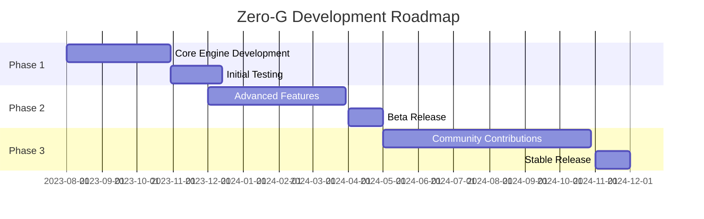

  

# 🚀 Zero-G: Defy Gravity, Embrace AI 🧠

## 🌌 Elevate Your AI Experience

Welcome to Zero-G, where artificial intelligence breaks free from earthly constraints! Our open-source, robust AI platform is designed to push the boundaries of what's possible in the realm of machine learning and cognitive computing.

### 🛰️ Features

| Feature | Description |
|---------|-------------|
| 🌐 Open-Source | Harness the power of community-driven development |
| 💪 Robust Architecture | Built to handle complex AI tasks with ease |
| 📈 Scalability | From small projects to enterprise-level applications |
| 🧠 Cutting-edge Algorithms | Stay ahead with the latest in AI research |

## 📊 Project Roadmap

  <h2>🌍 Mission Control</h2>
  <table>
    <tr>
      <th>🇧🇩 Base</th>
      <th>🌐 Website</th>
      <th>📧 Comms</th>
      <th>📡 Telegram</th>
    </tr>
    <tr>
      <td>Bangladesh</td>
      <td><a href="https://zero-g.agency">zero-g.agency</a></td>
      <td><a href="mailto:support@zero-g.city">support@zero-g.city</a></td>
      <td><a href="https://t.me/ZeroGAgency">@ZeroGAgency</a></td>
    </tr>
  </table>

  <h2>🤝 Join the Zero-G Community</h2>
  <table>
    <tr>
      <th>Platform</th>
      <th>Purpose</th>
      <th>Link</th>
    </tr>
    <tr>
      <td>GitHub</td>
      <td>Contribute to the project</td>
      <td><a href="https://github.com/Zero-GAgency/Zero-G">Zero-G Repository</a></td>
    </tr>
    <tr>
      <td>Telegram</td>
      <td>Community discussions</td>
      <td><a href="https://t.me/ZeroGAgency">@ZeroGAgency</a></td>
    </tr>
    <tr>
      <td>Website</td>
      <td>Official updates and resources</td>
      <td><a href="https://zero-g.agency">zero-g.agency</a></td>
    </tr>
  </table>

  <h2>📄 License</h2>
  
This project is licensed under the MIT License - see the <a href="LICENSE">LICENSE</a> file for details.

  

